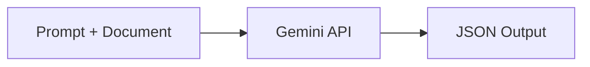

# my-gemini-requestor

A Python utility class to prompt **Gemini API** to convert a document (unstructured data) into equivalent JSON data (structured).

This is part of my larger end-to-end personal finance tracking project.

## 📌 Overview

